# IPC

```mermaid
sequenceDiagram
    participant D as Docker
    participant M as Main Process (background.js)
    participant R as Renderer
    participant A as <App />
    participant C as <components />
    
    M->>R: Create new BrowserWindow
    Note over R: preload.js
    Note right of R: preload.js exposes `tosbur` with contextBridge.exposeInMainWorld
    M-->>A: win.loadURL()
    Note over A: Vuex Store
    
    
    par For security reasons, components have no Node/Electron API access. We provide a safe way for them to communicate
        C-->>A: Dispatch actions to Vuex store
        A-->>+R: Invoke methods on global `tosbur`
        rect rgb(32, 64, 81)
            par Docker Engine API
                R-->>D: create/start/stop containers
                Note left of R: HTTP requests
            end
        end
        
        rect rgb(34, 40, 49)
            par Electron IPC
                R-->M: ipcMain and ipcRenderer
                Note left of R: Event emitters send messages and provide handlers for messages
            end
        end
        R-->>-A: response
        Note over A: Commit state changes in Vuex
        A-->>C: Mutations trigger re-render

    end
```

# Docker Engine API

The [Docker Engine API](https://docs.docker.com/engine/api/sdk/) is a RESTful API accessed by an HTTP client such as wget or curl, or the HTTP library which is part of most modern programming languages.

# Unix Domain Sockets

Docker Engine API requests are sent via unix domain sockets over the http protocol.

A [Unix domain socket](https://github.com/sindresorhus/got#unix-domain-sockets) or IPC socket (inter-process communication socket) is a data communications endpoint for exchanging data between processes executing on the same host operating system.

## Attaching to a container

According to the docs, we [attach to a container to read its output or send input](https://docs.docker.com/engine/api/v1.40/#operation/ContainerAttach).

## Questions

1. Can we use `curl container/{id}/attach` to attach to stdin/stdout to console?
2. 